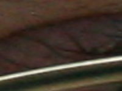
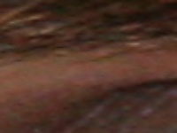
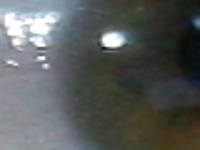
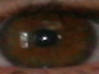
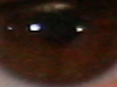
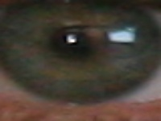
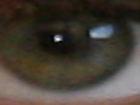

# Preliminaries

The purpose of this document is to write down any ideas for the first steps of this project, any experiments using potential methods fit for this problem, 
and the results of said experiments. Additionally, if outside sources (research projects, papers, etc.) are referenced/used, they will be linked here.

## Ideas

- Utilize concepts from assignment 02
  - Handling, manipulating, classifying images.
- Autoencoders (maybe)
  - [Link](https://www.jeremyjordan.me/autoencoders/)
- CNN (probably easier)
  - [Link](https://www.geeksforgeeks.org/convolutional-neural-network-cnn-in-machine-learning/)
  - [Youtube video](https://www.youtube.com/watch?v=U1toUkZw6VI)
- Vision Transformer (more powerful)
  - [Link](https://viso.ai/deep-learning/vision-transformer-vit/)
- TNSE
  - [Link](https://www.datacamp.com/tutorial/introduction-t-sne)
  - [Link](https://medium.com/@sachinsoni600517/mastering-t-sne-t-distributed-stochastic-neighbor-embedding-0e365ee898ea)
- UMAP
  - [Link](https://umap-learn.readthedocs.io/en/latest/)
- [This medium article](https://medium.com/@peter.gaston/iris-color-detection-using-fast-ai-826d1900bcf0) outlines a project done by Peter Gatson, in which he developed a ML model to detect eye color to determine what color of clothes people should where.
- An adjacent project was found on Github, where someone used machine learning models on data containing images of somewhat zoomed out pictures of eyes, 
training the models to detect the eye itself, then the iris, and the result was a cropped image of the isolated iris. It would be much easier for a 
model to detect a color of an iris if the image it is looking at is just the iris itself. Utilizing some of the concepts in this person's project could
definitely benefit our problem. The documentation in this repository is extensive, allowing us to derive our own conclusions, and create something that is 
uniquely tailored to our problem.
  - [This link](https://github.com/OmarMedhat22/Iris-Recognition-on-Ubiris-v2?tab=readme-ov-file) takes you to Omar's github page containing the project.

- This project uses openCV, which could be a useful tool for image processing.

## Experiments

1. In attempting to replicate the 'iris_extraction' code from [Omar's project](https://github.com/OmarMedhat22/Iris-Recognition-on-Ubiris-v2?tab=readme-ov-file), 
   one observation was that it takes exceptionally long to run, due to the large train data. One idea is to utilize the GPU with cuda.

2. To fix the issue of incorrect cropping of the images, changes were made to how the images were binarized (converted to black and white). Previously each image 
   was binarized using a static value. Dynamic thresholding was implemented from OpenCV.

3. Using the preprocessing code from previous experiments, we want to be able to pass in just one eye. This will be useful for the final product, in which we aim 
   to be able to change the color of a persons eye from a single picture of their face.

### Results

1. After debugging and running code to extract the iris from a picture for the first time, the results are somewhat useful. Some of the images contained just the 
   iris, some contained a partially cropped iris, and some were of just the eyelid or eyebrow, with no iris.

       

   The next steps from here will be to try to fine tune this model.

2. After implementing dynamic thresholding, the results were notably more accurate. The model seems to still struggle with images containing a lot of noise, or of     subjects with glasses.

      

3. With only one image, the thresholding is not working correctly. It is too bright.
   
