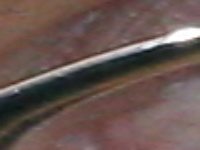

# Preliminaries

The purpose of this document is to write down any ideas for the first steps of this project, any experiments using potential methods fit for this problem, 
and the results of said experiments. Additionally, if outside sources (research projects, papers, etc.) are referenced/used, they will be linked here.

## Ideas

- An adjacent project was found on Github, where someone used machine learning models on data containing images of somewhat zoomed out pictures of eyes, 
training the models to detect the eye itself, then the iris, and the result was a cropped image of the isolated iris. It would be much easier for a 
model to detect a color of an iris if the image it is looking at is just the iris itself. Utilizing some of the concepts in this person's project could
definitely benefit our problem. The documentation in this repository is extensive, allowing us to derive our own conclusions, and create something that is 
uniquely tailored to our problem.
  - [This link](https://github.com/OmarMedhat22/Iris-Recognition-on-Ubiris-v2?tab=readme-ov-file) takes you to Omar's github page containing the project.

- This project uses openCV, which could be a useful tool for image processing.

## Experiments

In attempting to replicate the 'iris_extraction' code from [Omar's project](), one observation was that it takes exceptionally long to run, due to the large train data. One idea is to utilize the GPU with cuda.

### Results

After debugging and running code to extract the iris from a picture for the first time, the results are somewhat useful. Some of the images contained just the iris, some contained a partially cropped iris, and some were of just the eyelid or eyebrow, with no iris.

   
